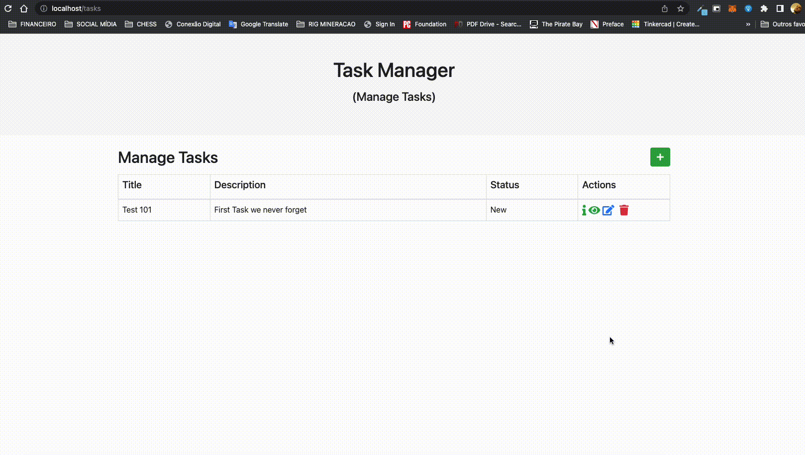

<h1> Task Manager </h1>
 

This code was inspired during studying Docker (Php, Apache, MySQL) and Laravel.
 
Following both tutorials:
<ul>
<li><a href="https://laravel.tutorials24x7.com/blog/the-complete-guide-to-perform-crud-operations-in-laravel-framework"> The complete guide to perform crud operations in laravel framework</a></li>
<li>
<a href="https://devops.tutorials24x7.com/blog/containerize-laravel-with-apache-mysql-and-mongodb-using-docker-containers">Containerize laravel with apache mysql and mongodb using docker containers</a>
</li>
</ul>

Note for the future, if you are having trouble creating routes, you MUST have:
LoadModule rewrite_module modules/mod_rewrite.so
into your .conf for the apache.
